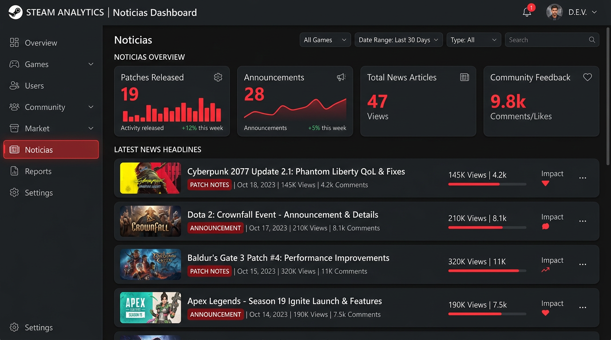
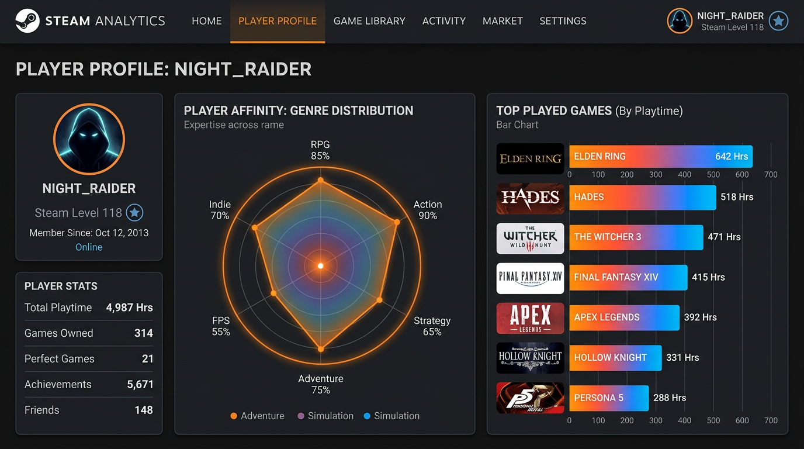

# 🎮 Steam Analytics Dashboard

Dashboard interactivo de análisis del ecosistema Steam desarrollado con **Streamlit** y **Python**, desplegado en Streamlit Cloud.

🔗 **App en vivo:** [steam-dashboard-app-icai.streamlit.app](https://steam-dashboard-app-icai.streamlit.app/)

---

## 📸 Capturas de la aplicación

### 📈 Tendencias
Análisis del mercado en tiempo real: Top juegos por jugadores concurrentes, distribución por géneros, compatibilidad de plataformas y evolución histórica.


### 📰 Noticias
Radar de noticias por juego con filtros temporales, métricas de parches y anuncios, y línea temporal histórica de publicaciones.



### 👤 Perfil de Jugador
Análisis de tu biblioteca Steam: Top 10 juegos, ADN por géneros (radar), distribución del tiempo y estado del backlog.



---

## 📋 Descripción

Herramienta de visualización en tiempo real que extrae y analiza datos directamente desde las APIs oficiales de Steam y CheapShark para ofrecer insights sobre el mercado de videojuegos.

## ✨ Funcionalidades

### 📈 Tendencias (Pestaña 1)
- **Top N juegos** por jugadores concurrentes (configurable 10-100)
- **Cross-filtering:** selecciona un juego o género en cualquier gráfico para filtrar el resto
- KPIs: jugadores totales, precio medio, juegos gratuitos
- Gráficos interactivos: barras (Top 10), treemap (géneros), donut (SO), scatter (precio vs Metacritic)
- **Evolución histórica** de jugadores (requiere `historial_top100.csv` del recolector)
- **Análisis de Precio Histórico:** precio mínimo (CheapShark), DLCs, descuentos
- Tabla resumen con todos los juegos filtrados

### 📰 Noticias (Pestaña 2)
- Noticias oficiales por juego con filtros temporales (última semana, mes, todo)
- Métricas: total impactos, parches, anuncios
- Publicaciones por categoría (Plotly)
- Evolución temporal de noticias
- Línea temporal histórica por mes (Matplotlib)
- Widget informativo con imagen del juego, fecha de lanzamiento y última actualización

### 👤 Perfil de Jugador (Pestaña 3)
- Análisis de biblioteca personal por SteamID64 o URL de perfil
- Top 10 juegos más jugados
- Radar de preferencias por género (normalizado 0-100%)
- Treemap de distribución del tiempo
- Donut de estado del backlog (jugados vs sin abrir)
- Historial de actividad por año de última partida

---

## 🛠️ Tecnologías

| Componente | Tecnología |
|------------|-----------|
| Frontend | Streamlit |
| Visualización | Plotly, Matplotlib |
| Datos | Pandas |
| APIs | Steam Web API, Steam Store API, CheapShark API |
| Recolección | GitHub Actions (cron cada 10 min) |
| Deploy | Streamlit Cloud |

## 🔌 APIs Utilizadas

| API | Uso | Autenticación |
|-----|-----|---------------|
| [Steam Web API](https://developer.valvesoftware.com/wiki/Steam_Web_API) | Rankings, noticias, perfiles de jugador | API Key |
| [Steam Store API](https://store.steampowered.com/api/appdetails) | Precios, géneros, plataformas, contenido adicional | Sin key |
| [CheapShark API](https://www.cheapshark.com/api) | Precio mínimo histórico con fecha | Sin key |

---

## 🚀 Instalación Local

### 1. Clonar el repositorio
```bash
git clone https://github.com/Miguelmotacava/Steam-dashboard.git
cd Steam-dashboard
```

### 2. Crear entorno virtual
```bash
python -m venv venv
# Windows
venv\Scripts\activate
# Linux/Mac
source venv/bin/activate
```

### 3. Instalar dependencias
```bash
cd App_streamlit
pip install -r requirements.txt
```

### 4. Configurar variables de entorno
Crear archivo `.env` en `App_streamlit/`:
```env
STEAM_API_KEY=tu_api_key_aqui
```
> Puedes obtener tu API Key en [steamcommunity.com/dev/apikey](https://steamcommunity.com/dev/apikey)

### 5. Ejecutar
```bash
cd App_streamlit
streamlit run app_steam.py
```
O desde la raíz: `.\run_app.ps1` (Windows)

---

## 📁 Estructura del Proyecto

```
proof/
├── App_streamlit/
│   ├── app_steam.py          # Aplicación principal
│   ├── data_api.py           # Llamadas a APIs (Steam, CheapShark)
│   ├── tab_tendencias.py     # Pestaña Tendencias
│   ├── tab_noticias.py       # Pestaña Noticias
│   ├── tab_jugador.py        # Pestaña Perfil de Jugador
│   ├── config.toml           # Tema Streamlit
│   ├── requirements.txt
│   └── .streamlit/
│       └── secrets.toml.example
├── recolector.py             # Script de recolección Top 100
├── historial_top100.csv       # Datos históricos (generado por workflow)
├── .github/workflows/
│   └── recolector.yml        # Ejecución cada 10 min
├── run_app.ps1               # Script de ejecución (Windows)
├── docs/images/              # Capturas de pantalla
└── README.md
```

---

## 📄 Licencia

Proyecto académico — Máster Big Data ICAI (2025-2026), asignatura de Visualización.

## 👤 Autor

**Miguel Mota Cava** — [GitHub](https://github.com/Miguelmotacava)
